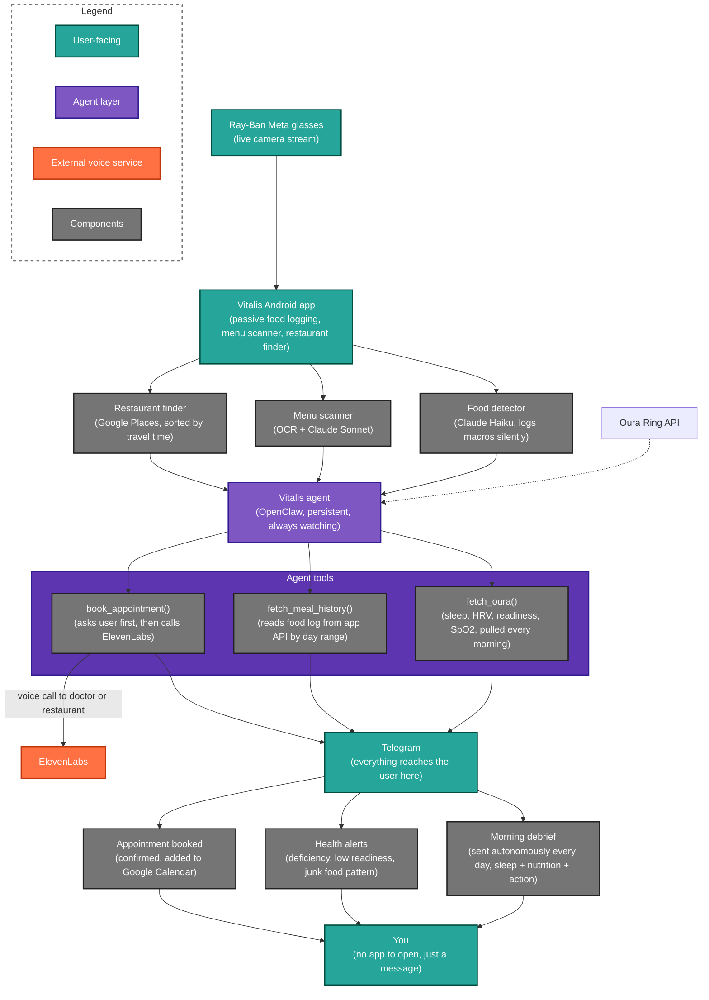

# Vitalis

Vitalis is a personal health AI agent. It runs continuously in the background, monitors your sleep and nutrition, notices patterns, and acts on them, without being asked.

It is built across two systems. The [Vitalis Android app](https://github.com/leekycauldron/vitalis) runs on your phone and streams from Ray-Ban Meta glasses, passively logging everything you eat or drink just by looking at it. This agent, the AI layer, reads that data, combines it with your Oura Ring metrics, and reasons across both to give you genuinely useful, personalised health guidance through Telegram.

---

## Why We Built It This Way

Most health apps require you to do the work. You log your meals manually, you open the app to check your stats, you remember to act on what you see. Nobody actually does this consistently.

Vitalis removes that friction entirely. The glasses see what you eat and log it automatically. The agent reads that log, pulls your sleep and recovery data from your Oura Ring, and puts everything together into a single reasoning layer that knows your body, your goals, your patterns, your deficiencies, and talks to you like a person who has been paying attention.

The app is the eyes. The agent is the brain.

---

## How It Works

When you look at food while wearing your Ray-Ban Meta glasses, the Vitalis app detects it through the camera, classifies it, and logs the meal; calories, macros, and whether it fits your dietary goals, silently in the background. No tapping, no searching, no manual entry.

That food log is exposed via API. This agent reads it continuously, combines it with your Oura Ring data, and reasons across both. If you have been consistently low on iron for four days, it tells you. If your readiness score dropped because you slept poorly after eating late, it connects those dots. If the pattern looks serious enough to warrant a doctor, it offers to call and book one — and when you say yes, it picks up the phone.

Everything comes through Telegram. You do not open a separate app. You just get a message.

---

## Agentic Behaviour

This is the core of what makes Vitalis different from a chatbot or a health tracker. Vitalis does not wait for you to ask. It acts on its own.

**Every morning, without being prompted**, Vitalis wakes up, calls `fetch_oura()` to pull your latest sleep score, HRV, and readiness, calls `fetch_meal_history()` to review what you ate the day before, and sends you a personalised morning briefing. You did not ask for it. It just shows up — with your actual data, a specific insight, and one clear action for the day.

**Throughout the day, it keeps watching.** If it detects that your iron has been critically low for three or more days in a row, it sends you a message on its own. If your readiness score drops below 60, it reaches out unprompted and tells you why and what to do. If your meal log shows a pattern of poor food choices across multiple consecutive meals, it nudges you directly with a better alternative. None of this requires you to open the app or ask a question. Vitalis notices and it acts.

**When something looks serious**, Vitalis goes further. If a sustained nutritional deficiency or concerning health pattern crosses the threshold where professional care is warranted, it does not just send a warning. It tells you plainly what it has noticed, recommends you see a doctor, and offers to make the call itself. When you confirm, it calls the clinic via ElevenLabs, books the appointment, adds it to your Google Calendar, and sends you a confirmation with a 30-minute reminder — all autonomously, from a single word.

This is the distinction between a tool and an agent. A tool responds when you use it. Vitalis monitors what is happening to you and acts on it.

---

## Features

- **Autonomous morning briefing** — sent every morning without prompting, combining Oura sleep and readiness data with the previous day's meal log and one specific action for the day
- **Proactive deficiency alerts** — if a nutritional gap persists across 3 or more days, Vitalis sends a message on its own flagging it and telling you exactly what to eat or buy
- **Recovery-aware nudges** — low readiness triggers an unprompted message with lighter activity suggestions tied to what you actually ate and how you actually slept
- **Junk food pattern detection** — consecutive poor meal choices trigger a direct nudge with a better alternative aligned to your goals, sent automatically
- **Autonomous doctor booking** — if a pattern looks clinically concerning, Vitalis recommends care, offers to call, and on confirmation makes the call via ElevenLabs, books the appointment, and adds it to Google Calendar
- **Passive food logging via glasses** — the Vitalis app logs meals automatically through the Ray-Ban Meta camera so the agent always has accurate data without any manual input

---

## Agent Identity

Vitalis speaks like a knowledgeable friend, warm, direct, and practical. It does not pad responses with disclaimers or filler. It does not give generic advice. Every message references your actual data.

Full personality, operating style, autonomous behaviours, and boundaries are defined in `IDENTITY.md` in this repo.

Core principles:

- Short and direct for daily check-ins and alerts
- Detailed only when the data warrants it or when you ask
- Always data-grounded — Oura and meal history before any recommendation
- Never diagnoses or prescribes — if something looks serious, it says so plainly and helps you get to the right professional
- Always asks for explicit confirmation before calling any external number or taking action outside the conversation

---

## Tools

| Tool | Description |
|---|---|
| `fetch_oura()` | Fetches sleep score, readiness, HRV, SpO2, resting heart rate, and activity from Oura Ring |
| `fetch_meal_history(days)` | Fetches the logged meal history from the Vitalis app for the last N days |
| `log_meal_history()` | Logs a meal with name, macros, and timestamp |
| `book_appointment(reason, number)` | Places a real phone call via ElevenLabs to book a doctor visit or restaurant reservation — only after explicit user confirmation |
| `send_morning_brief()` | Generates a morning briefing from recent Oura sleep and readiness data combined with yesterday's food log |

---

## Architecture

---

## Tech Stack

| Component | Technology |
|---|---|
| Agent framework | OpenClaw |
| Messaging | Telegram |
| AI reasoning | Google Gemini |
| Voice transcription | Groq Whisper |
| Phone calls | ElevenLabs |
| Health data | Oura Ring API |
| Food history | Vitalis app API |
| Calendar | Google Calendar API |
| Language | Python 3.11 |

---

## Configuration

Agent identity, personality, autonomous behaviours, and tool definitions are defined in `IDENTITY.md`.

Environment variables are managed via `.env` — see `.env.example` for required keys.

---

## Related

**Vitalis glasses app** — [Click here for app](https://github.com/leekycauldron/vitalis)

**Vitalis agent repo** — [Click here for agent](https://github.com/SahibJ56/vitalis_v1/tree/main)
